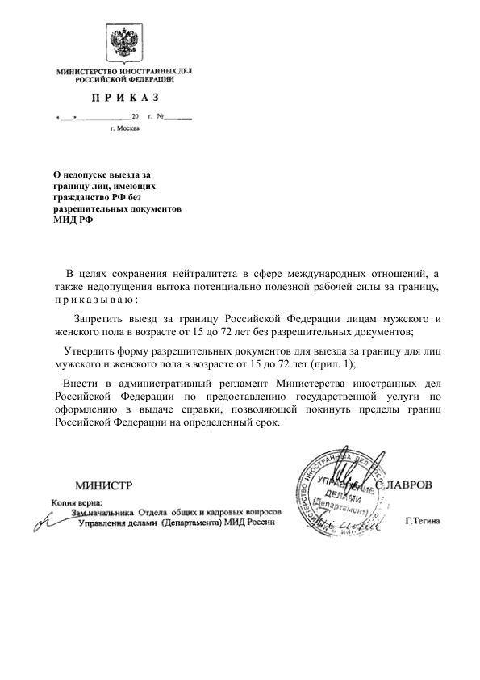
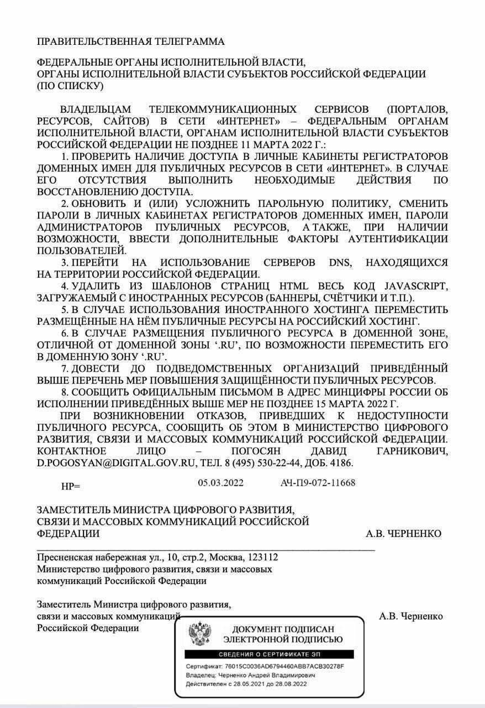

# Указ Сергея Лаврова о закрытиии границ. Телеграмма Черненко о переводе всех сервисов в отечественное интернет-пространство.

#### 6-го марта в свободный доступ попал указ, уже подписанный Лавровым. В нем говорится о закрытии границ Российской федерации на выезд для мущин и женщин от 15 до 72 лет.

#### 5-го марта всем государственным органам РФ была отправленна правительственная телеграмма с указаниями обрубить любую зависимость гос. ресурсов от мирового интернета. Это нельзя расценивать никак, кроме как подготовку к отключению от мировой сети интернета, и организацию системы на подобие "Великого Китайского Фаервола"

